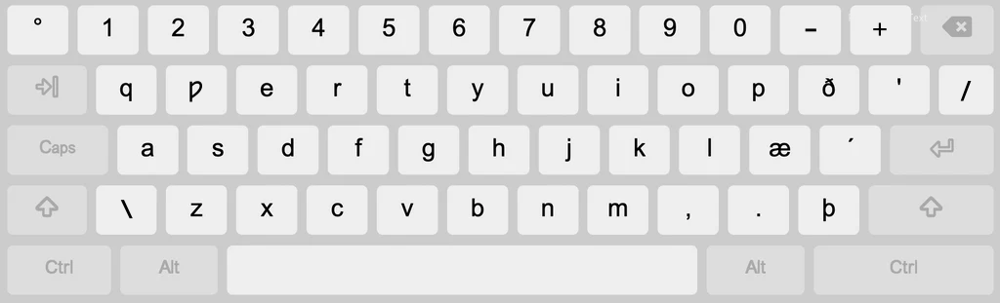

# About
In this project, I want to design, programme, and build a keyboard that uses a custom Middle English language layout. The design is inspired by a mix of the Icelandic and US-English keyboard layouts. I have no formal education in linguistics, but it does interest me. 

The inspiration for this project came from being a bit annoyed at copying and pasting certain Middle English characters repeatedly. While looking for a layout online, I stumbled across [A Keyboard Layout for Old English and Middle English](https://fieldomoss.com/old-english-keyboard) by [Moss Quanci](https://fieldomoss.com/), but I found it very complicated for my simple use, as I needed only the Middle English characters and extra diacritics for Old English were necessary for me. To add to that, I'm a Linux user (i use arch btw), so I wasn't able to use the layout as it was targeted towards Windows and Mac users. As I couldn't use it, I decided to make my own. 

*This project is currently in a draft state. I will keep working on it whenever I have free time.*

# Design Choices
As mentioned earlier, I am not a linguist, so I am unsure which letters and accents are appropriate for the time period Middle English was used. I will of course do my research, but do feel free to reach out to make suggestions and/or corrections. Any help is greatly appreciated. 

Also mentioned earlier, the Middle English keyboard layout is inspired by a mix of the Icelandic and US-English keyboard layouts. I have tried to keep the layout as close to possible to the US-English layout while having the extra keys from the Icelandic layout. 

## Draft of layout: 

*Credit of original image to: https://2-5.org/pages/icelandic-basic-keyboard*

### Changes: 
- *w* to be replaced with *ƿ* (wynn)

### List of Key Combinations: 
*To be added later*